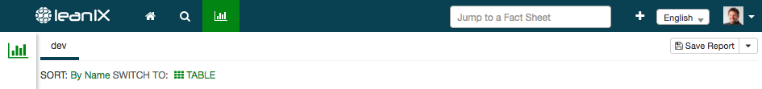

# Custom Dropdowns
This example shows how to use custom dropdowns.
The custom dropdown (named "SORT" in this example) is displayed above the report:


```js
import '@leanix/reporting';

lx.init()
.then(function (setupInfo) {
  var config = {
    menuActions: {
      customDropdowns: [{
        id: 'SORT_DROPDOWN',
        name: 'SORT',
        entries: [
          {
            id: 'SORT_BY_NAME',
            name: 'By Name',
            callback: () => {
              console.log('Sort by name...');
            }
          },
          {
            id: 'SORT_BY_DATE',
            name: 'By Date',
            callback: () => {
              console.log('Sort by date...');
            }
          }
        ]
      }]
    }
  };
  lx.ready(config);
});
```