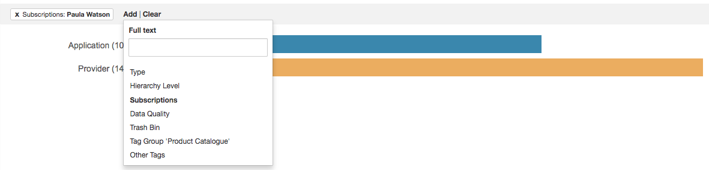
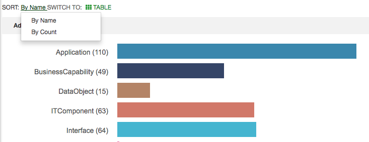
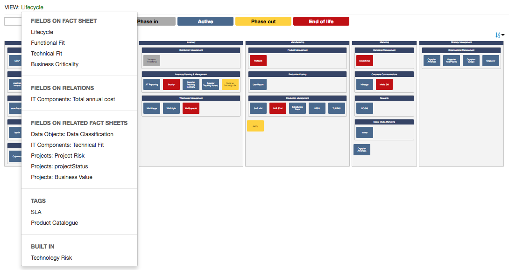
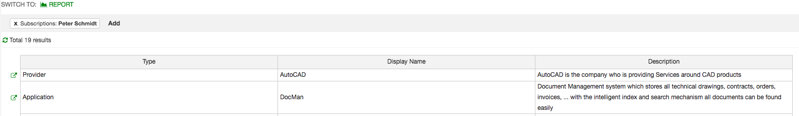
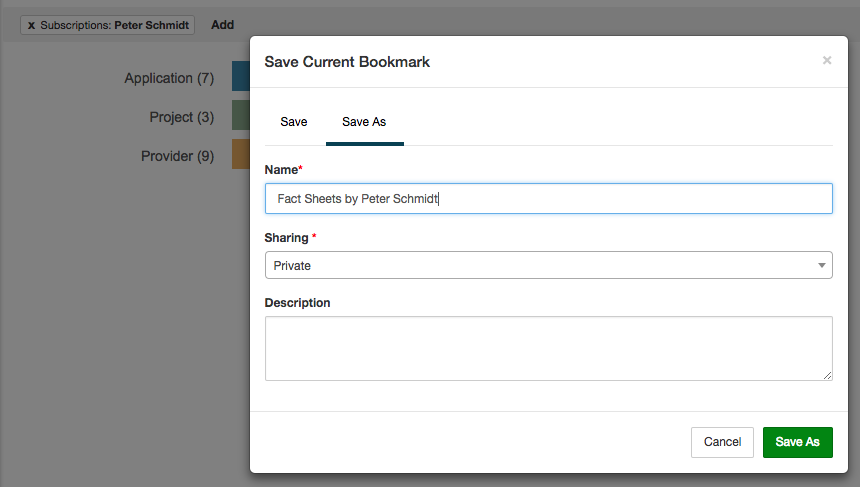

# Features of the LeanIX reporting framework

### Filterable Fact Sheet information
You can configure the framework to fetch certain information of the Fact Sheets contained in a workspace. The user is able to apply filters to the set of Fact Sheets as he/she is used to from the LeanIX inventory. [See example code](examples/get-filtered-data.md).

### Custom Dropdowns
You can configure the framework to display custom dropdowns to the user and inform you if he/she changes the selection. [See example code](examples/custom-dropdowns.md).

### Views
You can use view information in your report, which allows you to classify Fact Sheets based on their attributes. The framework will display a dropdown menu with all available views for a specific Fact Sheet type. Whenever the user selects one of these views, the framework will pass the new view information down into your report, so that you can work with that information in your visualization. [See example code](examples/report-views.md).

### Table view
For each report the user can switch to a tabluar view of the data that is currently displayed visually in the report. You can specify the columns of that table view that make sense for your report.

### Save and restore of filters and internal state
The framework provides an infrastructure to save the state of a report. This includes the currently applied filters (in case your report uses the filterable Fact Sheet feature) and potential internal state that the user can change within your report. The internal state is represented as a simple JSON. An example for internal state is, that the user can toggle between a barchart and a piechart representation.

### Translation of Fact Sheet types, fields, relations and field values
The framework provides you with functionality to translate any Fact Sheet type, field, relation or any field value related to the users current language. [See example code](examples/i18n.md).

### Formatting of numeric values as currency
The framework provides you with functionality to format a numeric value as a currency value related to the users current locale settings.

### Get configured meta data for fields (incl. icons and colors)
The framework allows you to get the configured meta data for fields at Fact Sheets or relations (e.g. for fields that are of type single select). This allows you to reuse the same colors and icons in the report visualisation and makes the integration into LeanIX look more seemless to the users.
